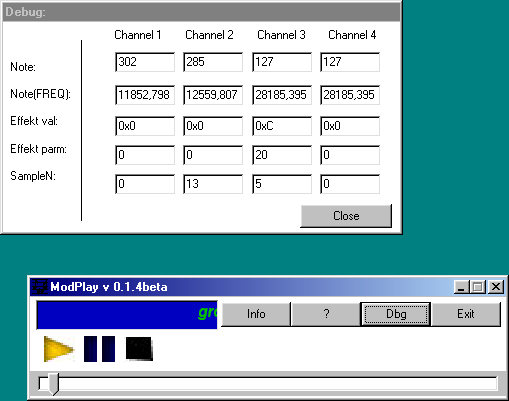



## Mod Player \(FULL VB code, no dll\`s\!\!\!\!\) v 0\.1\.4beta \(Channel and fix \+ new ide\!\)

### Description

Plays with full VB code mod files :)

In my last version, Channels are fixed (see code) and some errors repaired. akt. version: 0.1.4b.
 
### More Info
 

             |
---                |---
**Submitted On**   |2002-08-05 17:41:44
**By**             |[Denis Wiegand](https://github.com/Planet-Source-Code/PSCIndex/blob/master/ByAuthor/denis-wiegand.md)
**Level**          |Advanced
**User Rating**    |4.8 (48 globes from 10 users)
**Compatibility**  |VB 6\.0
**Category**       |[Sound/MP3](https://github.com/Planet-Source-Code/PSCIndex/blob/master/ByCategory/sound-mp3__1-45.md)
**World**          |[Visual Basic](https://github.com/Planet-Source-Code/PSCIndex/blob/master/ByWorld/visual-basic.md)
**Archive File**   |[Mod\_Player114591852002\.zip](https://github.com/Planet-Source-Code/denis-wiegand-mod-player-full-vb-code-no-dll-s-v-0-1-4beta-channel-and-fix-new-ide__1-37588/archive/master.zip)

